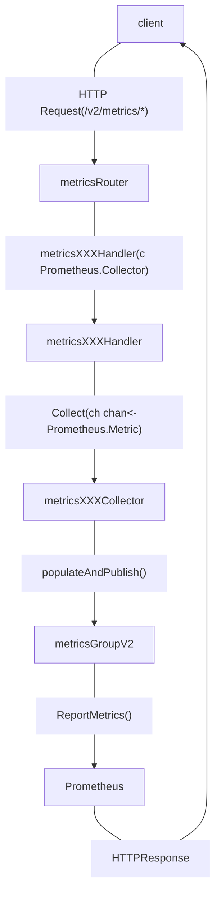

### invisible node

```mermaid
graph TD
	classDef transparentNode stroke-width:0px;
	A[client]
	B[metricsRouter]
	C[metricsXXXHandler]
	D[metricsXXXCollector]
	E[metricsGroupV2]
	F[Prometheus]
	AB["HTTP Request(/v2/metrics/*)"]
	BC["metricsXXXHandler(c Prometheus.Collector)"]
	CD["Collect(ch chan<-Prometheus.Metric)"]
	DE["populateAndPublish()"]
	EF["ReportMetrics()"]
	FA[HTTPResponse]
	class AB transparentNode;
	class BC transparentNode;
	class CD transparentNode;
	class DE transparentNode;
	class EF transparentNode;
	class FA transparentNode;
	A ---AB:::transparentNode --> B
	B ---BC--> C
	C ---CD--> D
	D ---DE--> E
	E ---EF--> F
	F ---FA--> A
	click AB "https://google.com"
	click BC "https://google.com"
	click CD "https://google.com"
	click DE "https://google.com"
	click EF "https://google.com"
	click FA "https://google.com"
```
