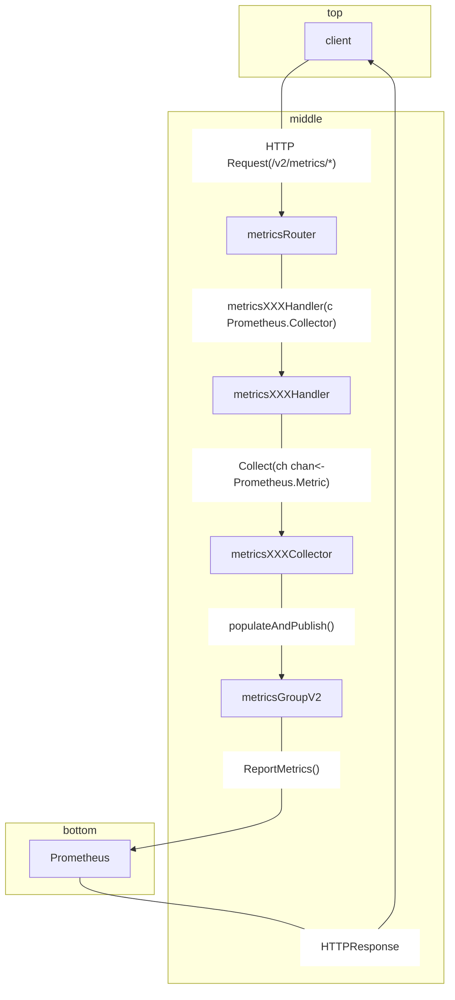

### invisible node

```mermaid
graph TD
	classDef transparentNode fill:#fff, stroke-width:0px;
	subgraph "top"
	A[client]
	end
	subgraph "middle"
	B[metricsRouter]
	C[metricsXXXHandler]
	D[metricsXXXCollector]
	E[metricsGroupV2]
	AB["HTTP Request(/v2/metrics/*)"]:::transparentNode
	BC["metricsXXXHandler(c Prometheus.Collector)"]:::transparentNode
	CD["Collect(ch chan<-Prometheus.Metric)"]:::transparentNode
	DE["populateAndPublish()"]:::transparentNode
	EF["ReportMetrics()"]:::transparentNode
	FA[HTTPResponse]:::transparentNode
	end
	subgraph "bottom"
	F[Prometheus]
	end
	%%class top transparentNode
	%%class middle transparentNode
	%%class bottom transparentNode

	A ---AB --> B
	B ---BC--> C
	C ---CD--> D
	D ---DE--> E
	E ---EF--> F
	F ---FA--> A
	click AB "https://google.com"
	click BC "https://google.com"
	click CD "https://google.com"
	click DE "https://google.com"
	click EF "https://google.com"
	click FA "https://google.com"
```
