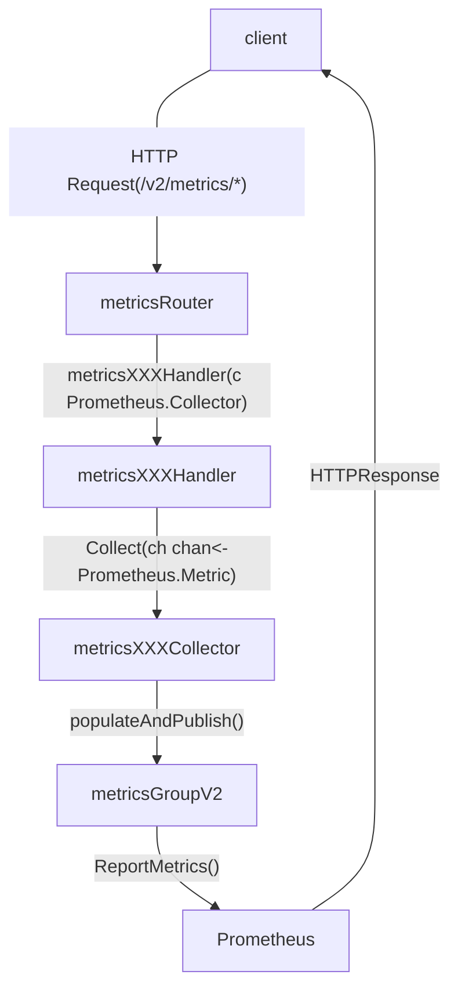

### invisible node

```mermaid
graph TD
	classDef transparentNode stroke-width:0px;
	A[client]
	B[metricsRouter]
	C[metricsXXXHandler]
	D[metricsXXXCollector]
	E[metricsGroupV2]
	F[Prometheus]
	AB["HTTP Request(/v2/metrics/*)"]
	A --- AB:::transparentNode --> B
	B -->|"metricsXXXHandler(c Prometheus.Collector)"| C
	C -->|"Collect(ch chan<-Prometheus.Metric)"| D
	D -->|"populateAndPublish()"| E
	E -->|"ReportMetrics()"| F
	F -->|HTTPResponse| A
```
